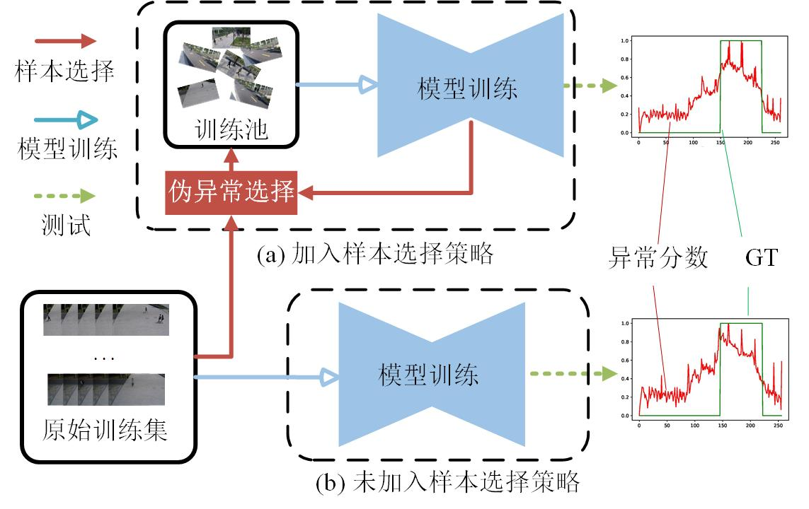

# PyTorch implementation of "SelAD"

<p align="center">


This is the implementation of the paper "Video Anomaly Detection with Training Data Sample Selection and Multi-Memory U-Net".


## Dependencies
* Python 3.8
* PyTorch 1.8.0+cu111
* Numpy
* Sklearn

## Datasets
* USCD Ped2 [[dataset](https://github.com/StevenLiuWen/ano_pred_cvpr2018)]
* CUHK Avenue [[dataset](https://github.com/StevenLiuWen/ano_pred_cvpr2018)]
* ShanghaiTech [[dataset](https://github.com/StevenLiuWen/ano_pred_cvpr2018)]

These datasets are from an official github of "Future Frame Prediction for Anomaly Detection - A New Baseline (CVPR 2018)".

Download the datasets into ``datasets`` folder, like ``./dataset/ped2/``

Use the script ``./dataset/to_frame.py`` to process videos data into image sequence.

## Training and evaluating
* The training and testing codes are based on frame prediction method
```bash
cd SelAD/runs
xx.sh for the corresponding results 
```
